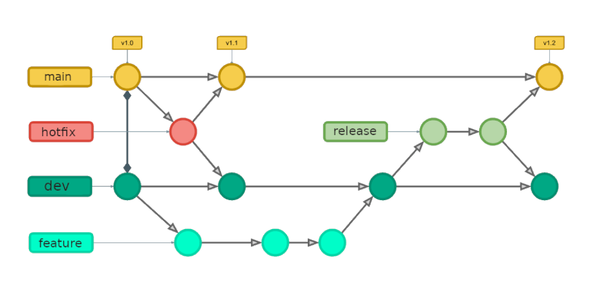

# Fluxo de trabalho

O Gitflow Workflow é um fluxo de trabalho do Git que auxilia o desenvolvimento contínuo de software e a implementação de práticas de DevOps [GITFLOW].

## Política de Branch



## Política de scm
### Mensagens de commit
A mensagem de commit deve seguir a seguinte regra: \
`#[número da issue] - [mensagem de commit]`

Exemplos de mensagem de commits numa branch para realizar a issue 120:
- `#120 - Criação da tela de cadastro de usuário`
- `#120 - Alteração das cores padrões dos botões`
- `#120 - Alterado lógica de checagem de email válido`

### Branches de desenvolvimento

São branches cujo as contribuições não são revisadas por um par. Contudo, algumas regras são aplicadas.

- **[R1]** - Toda branch de desenvolvimento deve estar ligada a um card/issue.

- **[R2]** - Existem dois tipos de branches. As branches `feature` e `hotfix`.

As branches `feature` , acomodam adição ou modificação de funcionalidades.

- **[R3]** - Nome da branch deve seguir o template `feature-<numero-issue>-<complemento>`. Sempre em letras minúsculas, sem acentos e caracteres espciais. \
Exemplo: `feature-1-laboratorio-spoon`

- **[R4]** - Deve ser criada a partir da branch `dev`.

As branches `hotfix`, acomodam correção de falhas/erros.

- **[R5]** - Nome de branch deve seguir o template `hotfix-<numero-issue>-<complemento>`. Sempre em letras minúsculas, sem acentos e caracteres especiais.\
Exemplo: `hotfix-2-correcao-na-funcao-de-exportacao`
- **[R6]** - Deve ser criada a partir da branch `dev` ou `main`.

### Branches controladas
Essas branches não aceitam commits diretos e somente pessoas autorizadas podem modificá-las. 

- A modificação se dá por meio de revisão em pull request

As branches controladas são:

- **`main`**: apenas versões liberadas para uso. 
- **`develop`**: baselines a partir das quais branches de desenvolvimento são criadas. Apenas uma baseline em `develop` dá origem a uma próxima versão ou mudança em `main`.
- **`review`**: baseline candidata a ir a produção (main)

### Integração nas branches de desenvolvimento
O desenvolvedor, nos dias em que houver trabalho na branch de desenvolvimento, deve pelo menos uma vez:

- Atualizar a branch de desenvolvimento (local) com os dados da `dev` (remote)
  ```sh
  git switch <sua-branch>
  git merge origin/dev
  ```
- Atualizar a branch de desenvolvimento (remote) com suas evoluções (branch de desenvolvimento local)
  ```sh
  git switch <sua-branch>
  git add .
  git commit -m "<mensagem-commit>"
  git push
  ```


### Integração na DEVELOP
O desenvolvedor deve solicitar pull request da branch de desenvolvimento (remote) para a `dev` (remote).

Se o pull request for aprovado, o revisor deve fazer a revisão pra verificar se está de acordo com a documentação do projeto, fazer o merge e deletar a branch de desenvolvimento. \
Se o pull request for reprovado, ele deve ser fechado. **O desenvolvedor deve reabrir o PR após finalizar as alterações.**

### Pull request
- **Pull request de trabalhos concluídos:** devem possuir o nome da branch 
- **Pull request de trabalhos em andamento, e que o objetivo não seja a integração com a `dev`:** o nome deve ter o prefixo `DRAFT-` e em sua descrição deve conter o propósito de sua criação (dúvida, feedback, impedimento etc).

### Referências
- [Fluxo de trabalho de GitFlow](https://www.atlassian.com/br/git/tutorials/comparing-workflows/gitflow-workflow)
